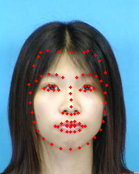
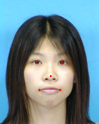
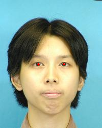

<!--
 * @Description: 
 * @Author: shaonianruntu
 * @Github: https://github.com/shaonianruntu
 * @Date: 2020-11-06 19:59:48
 * @LastEditTime: 2020-11-06 21:57:49
-->

# DLIB
Face key point detection and face alignment

## Code Description
### `dlib_landmarks.py`
Use to detect and mark key points of human faces.
You can choose to detect 81 key points or only 68 key point by change `dlib_modes`.
And you can choose to only detect five sense organs by setting `dlib_five=True` 

Results are:
| 68 key points                                          | 81 key points                                          | 5 key points                                          |
| ------------------------------------------------------ | ------------------------------------------------------ | ----------------------------------------------------- |
|  |  |  |

### `face_detect_align.py`
Use to align and unify all faces in dataset according to the distance between the eyes.
You can choose to visible all face key points on aligned face dataset by use `landmark_visible`.
And you can choose to visible just two eyes on aligned face dataset by use `landmark_visible`.
Default is no visible any face key points.

Results are:
| aligned face 1                                    | aligned face 2                                    | aligned face 3                                    |
| ------------------------------------------------- | ------------------------------------------------- | ------------------------------------------------- |
|  |  |  |


# Support package required
- numpy
- PIL
- python-opencv
- dlib
- face_recognition

## Installation method
> These packages may not be included in Anaconda and require additional installation

### python-opencv
```
sudo apt-get install python-opencv
```

### dlib
```
sudo apt-get install build-essential cmake
sudo apt-get install libgtk-3-dev
sudo apt-get install libboost-all-dev
```
```
pip install dlib
```

### face_recognition
```
pip install face_recognition
```